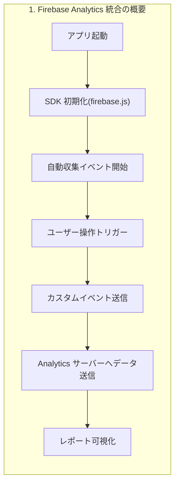

**解説**
「Firebase Analytics 統合の概要」は、アプリ起動から Analytics にデータが届き、コンソールで可視化されるまでの大まかな流れを示しています。

1. **アプリ起動**

   * ブラウザでアプリをロードし、エントリーポイント（`src/index.js`）が実行されます。
2. **SDK 初期化**

   * `src/firebase.js` で `initializeApp()` と `getAnalytics()` が呼ばれ、Firebase SDK が設定情報をもとに初期化されます。
3. **自動収集イベント開始**

   * SDK 初期化直後に、ページビューやセッション開始などの自動イベントがバックグラウンドで送信されます。
4. **ユーザー操作トリガー**

   * 購入ボタンなど、アプリ内の任意の操作がログイベントを発火するトリガーになります。
5. **カスタムイベント送信**

   * `logEvent(analytics, 'purchase', {...})` によって、ユーザー定義のイベントが Analytics サーバーへ送られます。
6. **Analytics サーバーへデータ送信**

   * 自動・カスタムイベントの両方が GA4 サーバーへ配信されます。
7. **レポート可視化**

   * Firebase コンソールのリアルタイムビューやイベントレポートで、送信されたデータが確認できます。

**コード例**（概要）

```javascript
// src/firebase.js
import { initializeApp } from 'firebase/app';
import { getAnalytics } from 'firebase/analytics';

const firebaseConfig = {
  apiKey: "YOUR_API_KEY",
  projectId: "YOUR_PROJECT_ID",
  appId: "YOUR_APP_ID",
  measurementId: "G-MEASUREMENT_ID"
};

// 1. SDK 初期化
const app = initializeApp(firebaseConfig);
// 2. Analytics インスタンス取得
const analytics = getAnalytics(app);

export { analytics };
```
