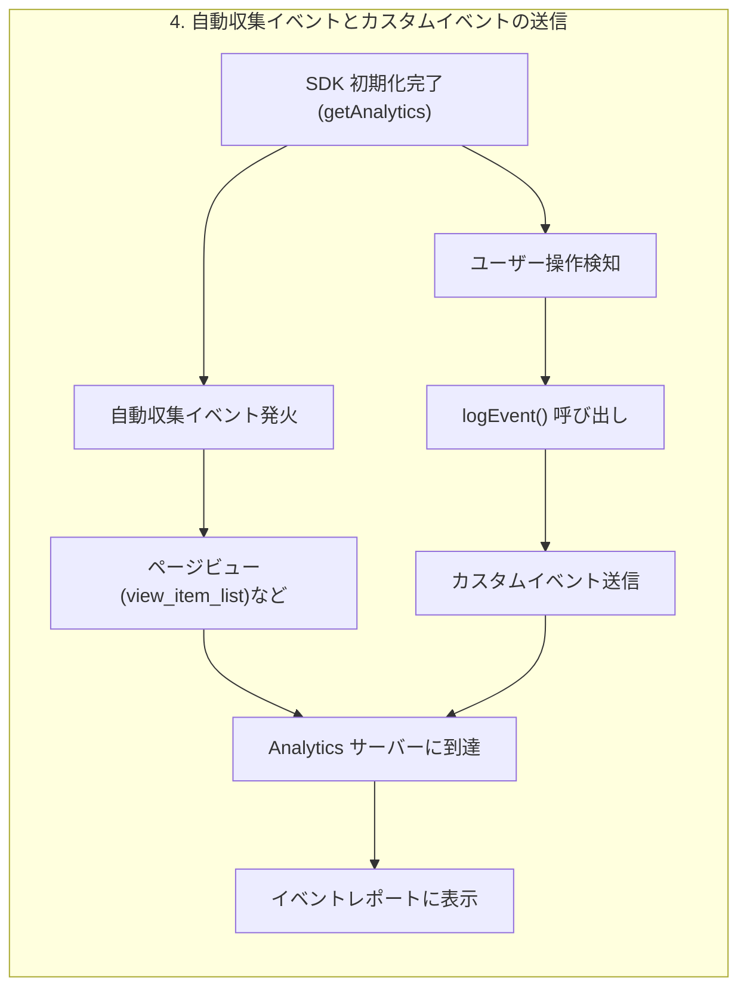

**解説**

### What（何をするか）

* **自動収集イベント**：SDK 初期化後に自動的に発火するページビューやファーストオープンなどのプリセットイベントです。
* **カスタムイベント**：`logEvent(analytics, 'event_name', parameters)` を用いて任意の操作を Analytics に送信します。

### Why（なぜ必要か）

* 自動収集：ユーザーの基本行動（ページ閲覧、セッション開始）を漏れなくキャプチャし、デフォルトで効果計測を可能にします。
* カスタムイベント：アプリ固有の重要アクション（購入、フォーム送信など）を詳細に計測し、ビジネスインサイトを得るためです。

### How（どのように実装するか）

```javascript
import { getAnalytics, logEvent } from 'firebase/analytics';
import { analytics } from './firebase';

// 自動収集は initializeApp() + getAnalytics() の呼び出しで開始
// 追加設定不要で以下のイベントが自動送信されます
// view_item_list, session_start, first_open など

// カスタムイベントの例
function trackPurchase(productId, price) {
  logEvent(analytics, 'purchase', {
    item_id: productId,
    value: price,
  });
}

// 呼び出し例
button.addEventListener('click', () => {
  trackPurchase('SKU_123', 1500);
});
```
