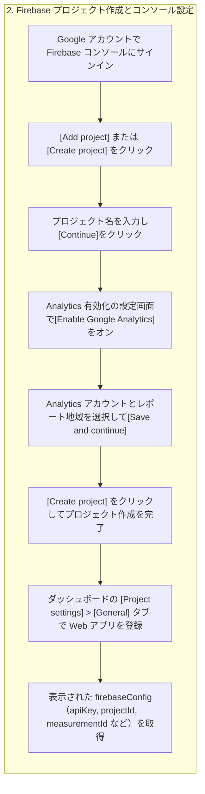

**解説**

1. **サインイン**：Firebase コンソールにアクセスし、使用したい Google アカウントでサインインします ([firebase.google.com](https://firebase.google.com/docs/projects/use-firebase-with-existing-cloud-project?utm_source=chatgpt.com)).
2. **プロジェクト作成ボタン**：ダッシュボード上部またはサイドバーの \[Add project]（既存プロジェクト追加の場合は \[Add Firebase]）をクリックします ([firebase.google.com](https://firebase.google.com/docs/android/setup?utm_source=chatgpt.com)).
3. **プロジェクト名の入力**：プロジェクト名を入力し、必要に応じて既存の Google Cloud プロジェクトを選択できます ([firebase.google.com](https://firebase.google.com/docs/projects/use-firebase-with-existing-cloud-project?utm_source=chatgpt.com)).
4. **Google Analytics の有効化**：Analytics を有効化すると、`measurementId` が自動生成され、後続の設定や API 呼び出しで必要になります ([firebase.google.com](https://firebase.google.com/docs/analytics/get-started?utm_source=chatgpt.com)).
5. **Analytics アカウントの選択**：既存の Analytics アカウントを選ぶか、新規作成し、レポートの地域を指定して同意します ([firebase.google.com](https://firebase.google.com/docs/web/setup?utm_source=chatgpt.com)).
6. **プロジェクト作成完了**：Firebase サーバー側でリソースが構成され、数分でダッシュボードが利用可能になります ([firebase.google.com](https://firebase.google.com/docs/projects/use-firebase-with-existing-cloud-project?utm_source=chatgpt.com)).
7. **Web アプリ登録**：\[Project settings] の \[Your apps] で Web アイコンを選択し、アプリ名を入力して登録します ([firebase.google.com](https://firebase.google.com/docs/analytics/get-started?utm_source=chatgpt.com)).
8. **コンフィグ取得**：表示される `firebaseConfig` オブジェクト内に `apiKey`、`projectId`、`appId`、`measurementId` が含まれます。この設定を後でコードに貼り付けます ([firebase.google.com](https://firebase.google.com/docs/analytics/get-started?utm_source=chatgpt.com)).

**コード例**

```javascript
// Firebase コンソールから取得した設定例
const firebaseConfig = {
  apiKey: "AIza...",
  authDomain: "my-app.firebaseapp.com",
  projectId: "my-app",
  storageBucket: "my-app.appspot.com",
  messagingSenderId: "1234567890",
  appId: "1:1234567890:web:abcdef123456",
  measurementId: "G-ABCDEFG123"
};
```
