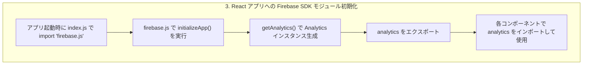

**解説**
React アプリで Firebase Analytics を利用するためには、モジュラー SDK の初期化を一箇所にまとめ、再利用可能なインスタンスを生成しておくことがポイントです。以下で詳細を説明します。

### What（何をするか）

* **initializeApp()**：Firebase プロジェクト設定をもとにアプリを初期化します。
* **getAnalytics()**：初期化済みの Firebase App インスタンスから Analytics 用のクライアントを取得します。
* **export analytics**：取得した Analytics クライアントを他モジュールで再利用できるようにエクスポートします。

### Why（なぜ必要か）

* **一元管理**：初期化コードを `firebase.js` に集約することで、複数箇所で初期化を重複させずに済みます。
* **パフォーマンス**：重い初期化処理を一度だけ実行し、同じインスタンスを使い回すことでリソースを節約します。
* **可読性・保守性**：設定情報を一箇所にまとめ、環境変数の切り替えなども容易になります。

### How（どのように実装するか）

```javascript
// src/firebase.js
import { initializeApp } from 'firebase/app';
import { getAnalytics } from 'firebase/analytics';

// 事前に Firebase コンソールから取得した設定オブジェクト
const firebaseConfig = {
  apiKey: "YOUR_API_KEY",
  authDomain: "YOUR_PROJECT_ID.firebaseapp.com",
  projectId: "YOUR_PROJECT_ID",
  storageBucket: "YOUR_PROJECT_ID.appspot.com",
  messagingSenderId: "YOUR_SENDER_ID",
  appId: "YOUR_APP_ID",
  measurementId: "YOUR_MEASUREMENT_ID"
};

// SDK の初期化（副作用あり）
const app = initializeApp(firebaseConfig);

// Analytics クライアントの取得
const analytics = getAnalytics(app);

// 他のモジュールで利用できるようにエクスポート
export { analytics };
```

* `import './firebase.js'` を行うだけで初期化とインスタンス生成が走るため、エントリポイントやコンポーネント側では手軽に `analytics` をインポートして利用できます。
* Next.js などの SSR 環境ではクライアントサイドのみで実行する条件分岐が必要です。
