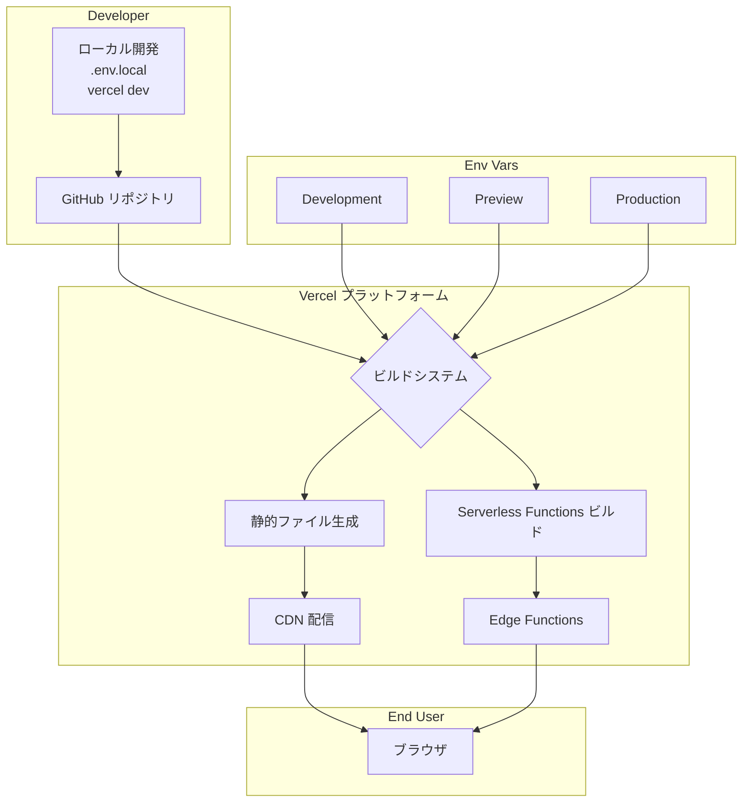

以下では、Vercel を使ったフロントエンド／バックエンドデプロイの典型的なパターンについて、アーキテクチャの関係図を Mermaid で詳細に示しながら解説します。まず概要をまとめ、その後環境変数の管理方法（`.env` と Vercel ダッシュボードの違い）、ビルド・デプロイのフロー、さらにはベストプラクティスをご紹介します。

## 概要まとめ

Vercel は Git リポジトリへのプッシュをトリガーに、ビルド→デプロイ→グローバル CDN 配信→サーバーレス関数実行までを自動化します。環境変数は Vercel ダッシュボードで安全に管理し、Production／Preview／Development ごとに切り替え可能で、`.env` ファイルだけに頼ると最新の値が反映されずリスクがあります([vercel.com][1], [vercel.com][2])。以下の Mermaid 図では、GitHub 連携からユーザーリクエストの流れ、環境変数の参照タイミングまで詳細に表現しています。

## 1. Vercel デプロイ アーキテクチャ

### 1.1 主なコンポーネント

* **開発者のローカル環境**: `vercel dev` や `.env.local` を利用し、ローカルで Preview 環境変数を読み込みながら開発
* **GitHub リポジトリ**: `main` ブランチへのプッシュで Production、その他ブランチで Preview デプロイが実行される([vercel.com][1])
* **Vercel プロジェクト**: ビルドとデプロイを実行し、環境ごとに異なる環境変数を注入
* **CDN + Edge Network**: 静的資産はグローバル CDN へ自動配信
* **Serverless Functions**: 動的 API が必要な場合は Serverless Functions（Node.js, Go, Python 等）として実行([vercel.com][3])

### 1.2 Mermaid 関係図

* `{Developer}` 内ではローカル開発時に `.env.local` や `vercel env pull` で Development 環境変数を取得します([vercel.com][2])。
* GitHub へのプッシュ（`main`／その他ブランチ）で Vercel がビルドを開始し、各環境の変数を C（ビルドシステム）に注入します([vercel.com][1])。
* ビルド後、静的資産は CDN、動的処理は Edge/Serverless Function として提供されます([vercel.com][3])。

## 2. 環境変数の管理方法

### 2.1 Vercel ダッシュボードでの設定

* **Production / Preview / Development** の各環境で個別にキー・バリューを設定可能で、値は暗号化・安全に格納されます([vercel.com][2])。
* ダッシュボードまたは CLI（`vercel env add`）から登録し、既存のデプロイには影響せず次回以降に反映されます([vercel.com][2])。

### 2.2 `.env` ファイルとの違い

* `.env.local` はローカル開発用。コミットせずに管理し、`vercel dev` で自動読み込みされますが、CI/CD や他メンバーの環境には共有されません([vercel.com][2])。
* `.env` をコミットすると機密漏洩のリスクあり。また、Vercel 本番環境では読み込まれず、必ずダッシュボードでの設定が必要です([stackoverflow.com][4])。

## 3. デプロイフロー詳細

1. **ローカル環境**:

   * `vercel login` → `vercel link` → `vercel env pull` で `.env` を生成
2. **コード変更 & プッシュ**:

   * GitHub プッシュ → Vercel が Webhook 受信
3. **ビルドステップ**:

   * Next.js 等のフレームワークが静的・サーバーレス用にビルド
   * 環境変数はビルド時・ランタイム時に注入
4. **デプロイ & 配信**:

   * 静的ファイル → CDN
   * API リクエスト → Edge / Serverless Functions

## 4. ベストプラクティス

* **秘密情報は必ず Vercel ダッシュボードで管理**（CLI 経由でも同様）し、`.env` に残さない([vercel.com][2])。
* **環境ごとに変数を分離**し、Production トークンを Preview／Development で絶対に用いないように設定([vercel.com][1])。
* **ローカル開発時は `vercel dev` を活用**し、実際の Vercel 環境変数を参照して本番に近い挙動を再現([vercel.com][2])。
* **Infrastructure as Code**（例：Terraform 連携）で環境変数をコード管理し、プロジェクトセットアップを自動化するとスケールしやすい（PlanetScale 連携例も参照）([planetscale.com][5])。
* **複数のカスタム環境**（staging, QA 等）が必要な場合は Pro／Enterprise プランで設定可能([vercel.com][1])。

以上が、Vercel を軸にしたデプロイパターンと環境変数管理の詳細解説です。マーメイド図を参考に、ご自身のプロジェクトに合わせてカスタマイズしてみてください。

[1]: https://vercel.com/docs/deployments/environments?utm_source=chatgpt.com "Environments - Vercel"
[2]: https://vercel.com/docs/environment-variables?utm_source=chatgpt.com "Environment variables - Vercel"
[3]: https://vercel.com/blog/building-secure-and-performant-web-applications-on-vercel?utm_source=chatgpt.com "Building secure and performant web applications on Vercel"
[4]: https://stackoverflow.com/questions/66293848/how-to-properly-set-environment-variables-in-next-js-app-deployed-to-vercel?utm_source=chatgpt.com "How to properly set environment variables in Next.js app deployed ..."
[5]: https://planetscale.com/docs/vitess/tutorials/deploy-to-vercel?utm_source=chatgpt.com "Deploy to Vercel - PlanetScale"
